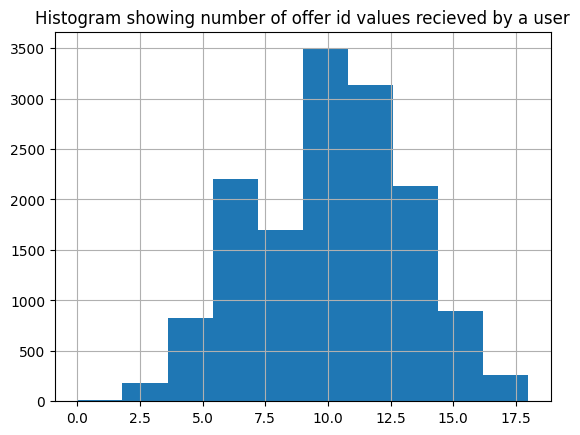
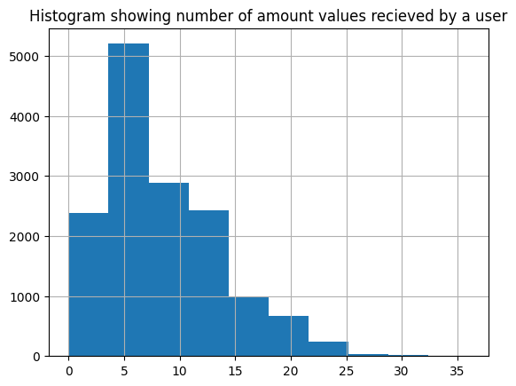
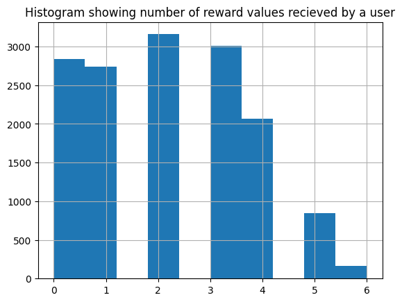

# Processing

## profile.csv:
-   Either all 3 attributes (income, gender, age) are present, or all 3 are absent together. For now I drop these rows

    ```
    print("Times all 3 attributes are absent together:", ((profile["income"].isna() == profile["gender"].isna()) == (profile["age"].isna() == profile["gender"].isna())).mean())
    print("Ratio of records where these 3 attributes are empty: ", profile["income"].isna().sum()/len(profile))

    Times all 3 attributes are absent together: 1.0
    Ratio of records where these 3 attributes are empty:  0.12794117647058822
    ```


-   Different users have different date of joining and incomes, and incomes usually increase every year. Need to calculate income of users on the latest date in the dataset. I assume growth rate of 8% PA. Also creating a new feature, `days_diff`, showing how long a user has been in the dataset (also better imputation)
    

## transcript.csv:

-   There are some entries where the dict in the `value` column has multiple items. Each key gets its own column for better clarity. A single user has multiple entries

## Aggregating:

-   Inner merging `new_transcript` above with `profile`. Can merge this  dataset with `portfolio`, if my target label needs to change from `offer_id` to something else

-   I'll keep duplicates for now, can't be sure if these are added accidentally or are valid. Could be an edge case where a user has been accidentally given the same offer/value twice, probably needs more analysis. Do we want this to happen, or do we want this to happen more frequently?

    ```
    print("Ratio of duplicate entries", (1 - len(mix.drop_duplicates())/len(mix)))

    Ratio of duplicate entries 0.004115253304325606
    ```

-   I can assume that every user would be getting atleast one offer_id and amount value (since the ratios are very low), hence I'll skip building models to find out if the user deserves these values or not

    Since 80% users have recieved a reward value, it makes sense to have a model that first predicts if a user should be given a reward value 
  
    The next model can determine how many reward values a user requires, or I can integrate both into one Deep Learning Model

    ```    
    print(" Ratio of users that haven't gotten any offer_id value: ", (transcript_grouped["offer_id"].count()==0).sum()/len(profile))
    print(" Ratio of users that haven't gotten any amount value: ", (transcript_grouped["amount"].count()==0).sum()/len(profile))
    print(" Ratio of users that haven't gotten any reward value: ", (transcript_grouped["reward"].count()==0).sum()/len(profile))

    Ratio of users that haven't gotten any offer_id value:  0.0003372681281618887
    Ratio of users that haven't gotten any amount value:  0.02246205733558179
    Ratio of users that haven't gotten any reward value:  0.1915008431703204
    ```

    {style="width:100px;"}

    {style="width:100px;"}

    {style="width:100px;"}

-   I create features that store mean and count of the values recieved by the users

    I'll ignore the event and time attributes originally from transcript (or new_transcript) since I think they come after an offer has been given to the user.
    
    If they're important: For the time attribute, I can get time_mean. If I have to use a simple ML model, I can add time_count, or i could get `offer_id_count` + `amount_count` + `reward_count`. For the event attribute, I could take the pivot table approach that I've done below for `offer_ids`


-   Since I can't average `offer_id` value like I did with the amount and reward value. I create a table where each row is a unique user and each column is a unique `offer_id` from `portfolio`, and each value is the number of times I see the `offer_id` and user together. For simplicity, this can be converted to binary to denote whether the user has recieved that `offer_id` or  not. 
    
-   Adding proper prefixes to the `user_ids` -> `xis-...` where ... is the `user_id`

-   I can merge new_profile with attributes I created with this new portfolio_profile to get all my features. I can afford inner join since i'll only lose 0.000337 (ratio value got from above) entries, else I could do imputation


# Analysis

```
print(final_dataset.columns)

Index(['gender', 'age', 'days_diff', 'max_date_income', 'offer_id_count',
       'amount_count', 'amount_mean', 'reward_count', 'reward_mean',
       'xid-0b1e1539f2cc45b7b9fa7c272da2e1d7','xid-2298d6c36e964ae4a3e7e9706d1fb8c2',
       'xid-2906b810c7d4411798c6938adc9daaa5',
       'xid-3f207df678b143eea3cee63160fa8bed',
       'xid-4d5c57ea9a6940dd891ad53e9dbe8da0',
       'xid-5a8bc65990b245e5a138643cd4eb9837',
       'xid-9b98b8c7a33c4b65b9aebfe6a799e6d9',
       'xid-ae264e3637204a6fb9bb56bc8210ddfd',
       'xid-f19421c1d4aa40978ebb69ca19b0e20d',
       'xid-fafdcd668e3743c1bb461111dcafc2a4'],
      dtype='object')

```

Let's just assume from now that columns in `final_dataset` have been noramlized and converted to one hot encoding wherever possible.

</br>

When I dropped 12% of my rows from `profile.csv` with missing attributes, I can run the same aggregating section from above, since those users are present in transcript.csv I'll run a DL model with `gender`, `age`, `max_date_income` as output labels that I predict from all other attributes in `final_fataset` allowing me to add them back


# Requirements: 

1.  What offers are optimal for different user segments (clearly define user segments and an appropriate metric that qualifies an offer to be optimal)?

-   I don't think user segments can be clearly defined, since >99% users have gotten an offer (considering an offer to be an `offer_id` from `portfolio.csv`), and each user has gotten multiple offers (more in 2nd requirement)

    What can be done, is to apply clustering on `final_dataset` or only on `xid-...` columns to obtain a new attribute (say `offer2`)

    For each `offer2`, it's possible to go through each user's original `xid-...` columns, getting a row sum and noramlise it along columns
  
    Based on the algorithm used, this might give meaningful insights into the proportion of each underlying `xid-...` used to make that `offer2`. If we looked at these proportions alongside the `portfolio` dataset, things might make sense

-   Eg. `offer2` `abc` is made up of offers (higher proportion in the row sum) that have high rewards, and barely includes offers that have low rewards. Hence users being segmented under `abc` are usually given high reward offers

-  We can either use insights from `offer2`, or from the scores of the Deep Learning models in the 2nd requirement to quantify how optional an offer is for a particular user. 

</br>


    
2.  Build a user level offer targeting model. Clearly explain your assumptions on data preparation, model set up and optimization criteria.

-   Dataset used for training: `final_dataset`. All assumptions have been defined during processing of data. No major assumptions have been made. However there is lack of clarity on some attributes, I've chosen to not include them in the final training dataset. 

-   If we still want user segments and some interpretability (figure out what type of users fit an offer, based on 1st requirement), we can run a decision tree for each `xid-...` column

-   I'm not very sure what's the end goal here. Is `offer_id` our end goal, or do we also care about predicting `reward` and `amount` inside the `value` attribute in `transcript.csv`.


    -   Case 1: Predict only `offer_ids` for each user, 

        All `xid-...` columns and `offer_id_count` are labels, everything else is given as input If `xid-...` columns are integers (binary mapping not applied). This tells us how many times an offer should be given to a user. If `xid-...` columns are binary This tells us if an offer should be given to a user.

        Model output layer `output1` has a an output with length equal to the number of `xid-...`'s, activation being `ReLU` when mapping is not applied, and `sigmoid` otherwise. (with appropriate loss functions `MSE` and `BCE`)
        
        I create `output2` layer which is just `sum(output1)` when binary mapping is not applied. When mapping is applied, i take the parent layer of `output2`, and use a Dense layer to create `output2` for `offer_id_count` 
      
    -   Case 2: anything else along with or apart from Case 1:
        
        If want to know the average/total `reward` and/or `amount` that should be given. Whatever attributes we want to find out considered as labels, everything else is given as input. We have one output layer `output1` that deals with integer output labeels, `output2` deals with binary labels (if they exist)


-   Hyper Parameters:

    Optimizer: Adam,    Train/test split: 90:10 (Cross validation with 10 folds optional),  Depth of ANN: 2-4 layers with normalization, etc in between,    Loss function: depends on case


</br>

3.  How would you quantify the efficacy of the user targeting model?

-   Using Loss from the Deep Learning models. In cases where we have 2 loss functions, domain knowledge and more clarity on the outcome is required to weight individual loss functions properly.